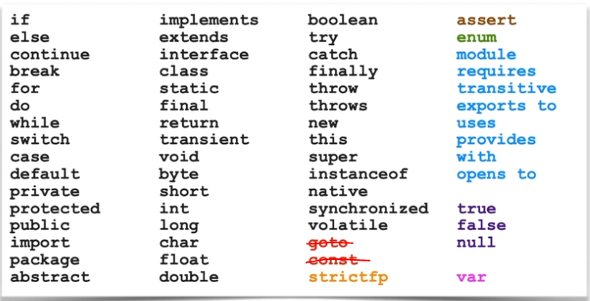

# OCP-1Z0-819
OCP Oracle Certified Professional Java SE 11 Developer practices

## Notes:
### Keywords


### Packages:
**package** is optional

### Access Modifiers
- **protected**: package, subclasses
- **no-modifier**: package

### Class
#### Abstract classes
- abstract methods only inside abstract class
- abstract class can implement interface class, and the abstract methods must be resolved by a concrete class
````java
public interface TestInterface{
    double calculateTax();
}

public abstract class TestClass implements TestInterface{
    public double calculateTax(double tax){} // this is not from TestInterface
}
````

#### Interfaces
- Instance methods are by default **public** and **abstract**
- Methods are concrete unless there is an **abstract** keyword
- By default, constants are **static** and **final**. They can contain constants but not variables.
- **default** keyword is not a modifier
- [public][abstract|default|static] | [private][static] **method**.
- [static][final] **field**.

````java
public interface <InterfaceName> [extends <OtherInterface>]{
        
    <constants>

    <abstract methods>

    <default methods>

    <private methods>

    <static methods>    
}

public interface IService extends ISuperService {
    int MY_STATIC_CONSTANT = 15; // a constant, static and final

    void myAbstractMethod(); // this is public and abstract method

    private String myConcreteMethod() { // this is a private concrete method
        return "I would be call by default method";
    }

    default String myDefaultMethod() { // this is a public default method
        return myConcreteMethod();
    }

    static int myStaticMethod() { // this is a static
        return MY_STATIC_CONSTANT;
    }

    private static String myPrivateStaticMethod() {
        return "all static are concrete";
    }
}
````
#### Inheritance rules of default methods
- a superclass (extended class) method takes priority over an interface **default method**.
- a subtype interface's **default method** takes priority over a super-type interface's **default method** of that subtype. 
- two equal subtypes interface's **default method** are going to be treated as abstract


#### Comparable interface
- We need to implement **int compareTo(T other)**
- Returns:
  - **0**: this == other
  - **1**: this > other 
  - **-1**: this < other

````java
public class MyClass implements Comparable<MyClass> {

    private int id;

    public MyClass(int aId) {
        this.id = aId;
    }

    @Override
    public int compareTo(MyClass other) {
        return (id == other.id) ? 0 : (id > other.id) ? 1 : -1;
    }
}
````

#### Main class
```java
public static void main(String[] args){}
```
Non-static field 'declared out of main' cannot be referenced from a static context

#### Methods
- The signature of a method is: a name +  parameter types
- No two method with the same signature can exist in a class, even if they have different return types

````java
public boolean fit(String sizeToCompare){}

public String fit(String otherSize){} // Method invocation is resolved based on a name +  parameter types
````
        
### Types

#### int
````java
int someInt = 10_000_000;
````

ranges: +/- **2.1B**


#### String
Uninitialized has a default value **null**

#### double
````java
double someDouble = 32.16;

double someDouble = 32.16d;

double someDouble = 32.16D;

double someDouble = 2.1E12;

double someDouble = 75; //Becomes 75.0
        
double someDouble = .3;

double someDouble = 4.0f;
````

### Variables

#### Names
- Names must not start with **_**, numeric characters or include a white space.
- Use **_** alone is illegal
- By convention, names must not start **$**

#### Declaration
````java
String name, city;

String country ="USA", state="CO";
````

#### Scope
Variables can have a scope of specific block of code
````java
if(price > 20){
    double discount = 0.5;
    price -= fee *  discount;
}
````

#### Local-variable type inference
````java
    var outputStream = new ByteArrayOutputStream();
    
    UnaryOperator<Integer> unaOp2 = (var x) -> x * 7;
    
    var x = 30;
    
    for(var item : items){}
    
    for(var i=0; i<10; i++){}
    
    var var = 10;
    
````
Where can var **not** be used?
````java
var price; // declarations without an initial value

var price = null; // initialization with a null value

var price = 9.95, tax = 0.05; // compound declarations

var prices = {9.95, 5, 3.50}; // Array initializers

public var price; // fields of a class

public void setPrice(var price){} // parameters of a method

public var getPrice(){} // method return types

(var x, y) -> x.process(y); // You could never mix implicitly and explicitly typed lambda parameters

(var x, int y) -> x.process(y);
        
var x -> x.toString(); // You cannot omit parenthesis for single explicitly typed lambda parameter

````
be careful with **interfaces**
````java
var list = new ArrayList<String>(); // inferred as ArrayList<String>
        
var itemQueue = new PriorityQueue<>(); // inferred as PriorityQueue<Object>
````
**numbers** usually are going to be inferred as **int** or **double**

### Operators
#### Operator precedence
- From left to right
- Parentheses
- ++/--
- Multiplication and division
- Addition and subtraction 


### Flow Control
#### switch
condition doesn't need to be final

````java
String codition = "Used";
switch(condition){
    case "Used": 
        discount = price * 0.1;
        break;
    default: 
        discount = price;
}
````

#### Loops

**for** statement

````java
    int i = 0;
        for (; ; ) {
            if (i >= 5)
                break;

            System.out.println(i);
            i++;
        }
````


### Arrays
#### Initialization
````java
String[] aString = {"St1","St2","St3"};

int[] aInt = {1,2,3};
````

#### Declaration
You instantiate **Arrays** when you use new type[value], you don't instantiate a type
````java
String[] aString2 = new String[3]; // an Array of 3 Strings
        
int[] aInt2 = new int[16]; // an Array of 16 ints
        
Recyclable[] rubbish = new Recyclable[3]; // we have an Array of Objects that implement the Recyclable interface
        
Toy[] myToys = new Toy[3]; // an Array of 3 abstract Toys
````

### Objects in Memory
- **Variables** are stored in the **Stack**
- **Objects** are stored in the **Heap**
- **Object references** are pointers and variables, they are store in the **Stack**

### Exceptions
#### Hierarchy
- Throwable **(checked)**
    - Exception **(checked)** / Error **(unchecked)**
        - RuntimeException **(unchecked)**

#### Flow
After an exception is handled, the execution continues after the last catch handler
````java
try{
    
    }catch(Exception e){
    System.out.println("exception is handled here");
}
System.out.println("execution continues here");
````

### Lambdas
- Lambda expressions are enabled by **functional interfaces**.
- A **function interface**, it's an interface that has exactly one abstract method.
- The remaining methods, if any, they are either default, static, or private.

````java
public interface FuncInterface{
    double abstractMethod(int x);
}

public class TestClass {
    FuncInterface lambda = x -> 2.0 * x;
}
````

#### Built-in functional interfaces
| Lambda Type     | Abstract Method | Example |
| ----------- | ----------- |-------|
| Function\<T,R\> | R apply(T t); | Function\<Integer,Double\> lambda = x -> 2.0*x; |
| UnaryOperator\<T\> | T apply(T t); | UnaryOperator\<Integer\> lambda = x -> 2*x; |
| Predicate\<T\> | boolean test(T t); | Predicate\<Integer\> lambda = x -> x==10; |
| Consumer\<T\> | void accept(T t); | Consumer\<Integer\> lambda = x -> System.out.println(x); |
| Supplier\<T\> | T get(); | Supplier\<String\> lambda = () -> "Canada"; |
| Runnable | void run(); | Runnable lambda = () -> System.out.println("Run"); |

#### Parentheses
- Parentheses are only optional with a single implicit parameter.

````java
Consumer<String> lambda = x -> System.out.println(x);

Consumer<String> lambda = (x) -> System.out.println(x);

Consumer<String> lambda = (String x) -> System.out.println(x);

BiConsumer<String, String> lambda = (x,y) -> System.out.println(x+y); 
````

#### Parameter don'ts
````java
(Item x, y) -> x.process(y); // You could never mix implicitly and explicitly typed lambda parameters
        
Item x -> x.toString(); // You cannot omit parenthesis for single explicitly typed lambda parameter
````

#### Braces 
- braces on lambda expressions are optional if a lambda expression contains only one statement. 
- Enclose multiple statements within curly braces. 
- Include a semicolon after each statement and at the end of the lambda expression.
- Include a return statement for expressions that return values.

````java
Consumer<String> lambda = x -> {
    x = x + "Chocolate";
    System.out.println(x);
};

Supplier<Double> lambda = () -> {return Math.PI;};
        
````

#### Shorthand
````java
Function<String, String> lambda = x -> x.toUpperCase();

Function<String, String> lambda = String::toUpperCase;
````

### Streams
- Streams are pipelines of data. 
- Collections are converted to streams, standard or parallel.
- Stream methods are chained together.
- Stream methods take lambda expressions as arguments.

````java
        List<String> names = List.of("Barclay", "Barry", "Bert", "Bot", "Bart");

        names.stream()                                                      // or .parallelStream()
                .filter(name -> name.contains("t"))                         // Predicate
                .filter(name -> name.contains("a") || name.contains("e"))  // Predicate
                .forEach(name -> System.out.println(name));                 // Consumer
````

#### Intermediate operations
- filter, peek, map, flatmap

#### Terminal operations
- forEach
- findFirst, findAny, max, min **return Optional**
- Optional.get() **return the data**
- Optional.orElse(T t) **return T**
- anyMatch, allMatch, noneMatch **return boolean**
- count **return long**

### Modularity

Listing all modules
````shell
$java --list-module
````

#### Types
- Standard modules: **java.***
- JDK modules: **jdk.***

#### Some modules
- java.base
- java.compiler
- java.desktop
- java.logging
- java.net.http
- java.se
- java.sql
- jdk.compiler
- jdk.httpserver
- jdk.jartool
- jdk.javadoc
- jdk.jdeps  
- jdk.jlink  
- jdk.jshell


#### Declaration

- A module is declare in a **module-info.java** file.
- It's placed in the root directory.
````java
module modulename {
    requires [transitive] ...;
    exports ... [to] ...;
}
````