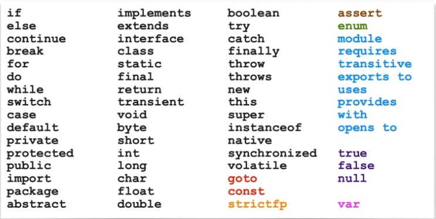

# OCP-1Z0-819
OCP Oracle Certified Professional Java SE 11 Developer practices notes.

## [Symbol names, math expressions and statements](resources/docs/symbols.md)

## Keywords


## Packages
**package** is optional.

## [Access modifiers](resources/docs/access-modifiers.md)

## [Class](resources/docs/class.md)

## [Types](resources/docs/types.md)

## [Variables](resources/docs/variables.md)

## [Operators](resources/docs/operators.md)

## [Flow Control](resources/docs/flow-control.md)

## [Arrays](resources/docs/arrays.md)

## [Collections](resources/docs/collections.md)

## Objects in memory
- **Variables** are stored in the **Stack**.
- **Objects** are stored in the **Heap**.
- **Object references** are pointers and variables, they are stored in the **Stack**.

## [Exceptions](resources/docs/exceptions.md)

## Logging API
- module: requires java.logging
- import java.util.logging.*
- Levels from bottom to top:
    - Severe
    - Warning
    - Info
    - Config
    - Fine
    - Finer
    - Finest

## Assertions

````java
assert <boolean expression>;
assert <boolean expression> : <error text expression> ;
````

## [Lambdas](resources/docs/lambdas.md)

## [Streams](resources/docs/streams.md)

## [IO](resources/docs/io.md)

## [Threads](resources/docs/threads.md)

## [Modularity](resources/docs/modules.md)

## Annotations
- **@FunctionalInterface** enforce the definition of a functional interface: only one abstract method
- **@Override** verify that a method actually overrides a parent operation
- **@Deprecation**
- **@SuppressWarnings** unchecked or deprecation

## JDBC
````java
public class Example {
  public static void main(String[] args) {
    String url = "jdbc:derby:localhost:1527:productDB";
    String username = "pm";
    String pwd = "not-a-password";
    BigDecimal price = BigDecimal.valueOf(10.3);
    String productQuery = "select id, name from products where price > ?";
    try (Connection c = DriverManager.getConnection(url, username, pwd);
         PreparedStatement s = c.prepareStatement(productQuery);
         s.setBigDecimal(1, price);
         ResultSet rs = s.executeQuery();         
    ) {

      while (rs.next()){
          int id = rs.getInt(1);
      }

    } catch (SQLException e) {
      String state = e.getSQLState();
      int code = e.getErrorCode();
    }
  }
}
````